**[IPsecVPN](https://ghost0000heavy.github.io/IPsecVPN)**

* L2TP/IPsec VPN On Windows Server 2016

   What is VPN?
   
A Virtual Private Network (VPN) is a secure network tunnel that allows you to connect to your private network from internet locations. So, you can access and use your internal resources based on your permissions.

Existing Active directory environment 
1. OS: Windows server 2016 
2. Domain Name: ITPROLABS.XYZ 
3. Domain IP: 192.168.153.10/24 
4. IP Scheme: 192.168.153.0/24

 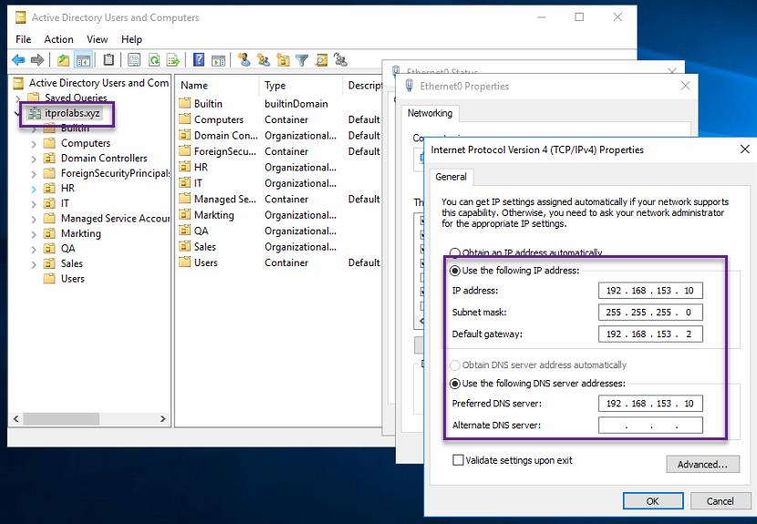
 
Existing DHCP Server Configuration: 

VPN clients will contact the DHCP server to obtain our internal TCP/IP configuration so they can access internal resources, the DHCP server configuration explained as below: 

1. Server IP: 192.168.153.10/24 
2. Scope range: 192.168.153.50 – 192.168.153.254 
3. DG: 192.168.153.2
4. DNS: 192.168.153.10

     

VPN Server Setup and Configurations 

Server Name: VPN LAN 
IP: 192.168.153.11/24
WAN IP: public IP address 
**Network configuration: 
      We have 2 network interfaces one for LAN connectivity (in our domain scope) and another for WAN that will receive VPN client connection requests from internet.
      
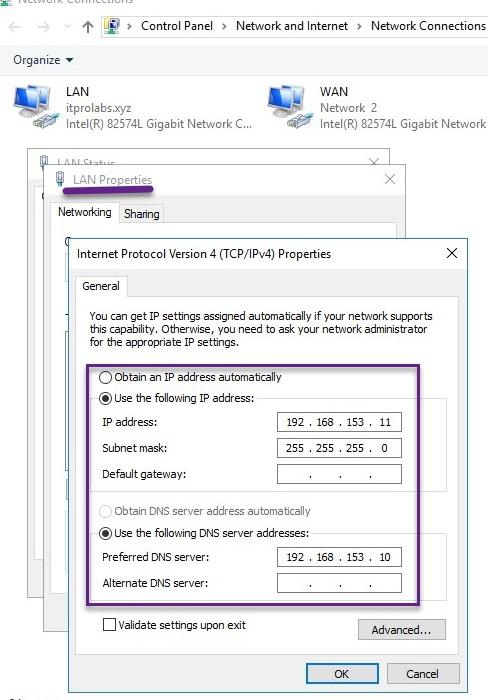 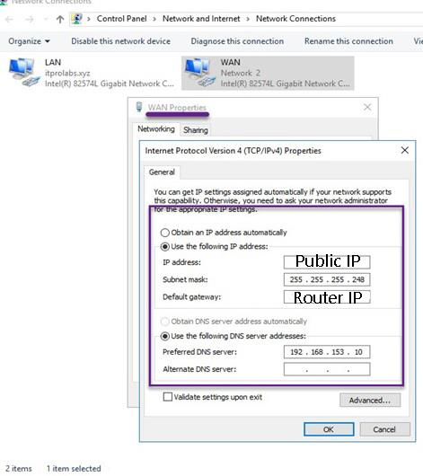

VPN Configuration Steps: 

Step 1: Join VPN Server to ITPROLABS.XYZ domain 

First, Join our VPN server to ITPROLABS.XYZ domain, so we can use active directory to authenticate the incoming VPN client connections.
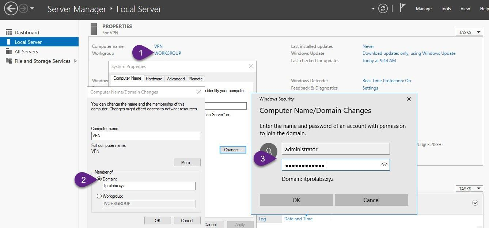

Step 2: Add Remote Access role

On VPN server, from Server Manager add remote access role as explained in the figures below

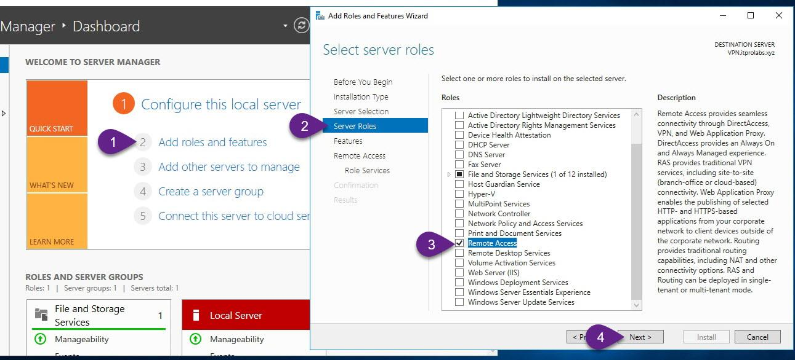
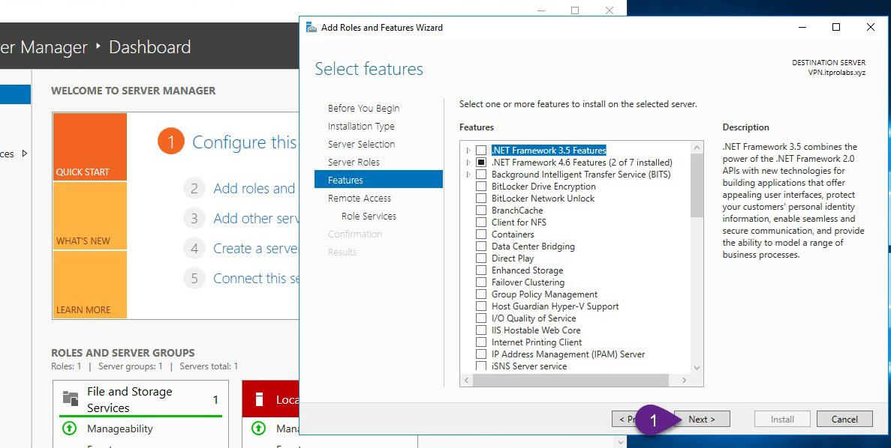
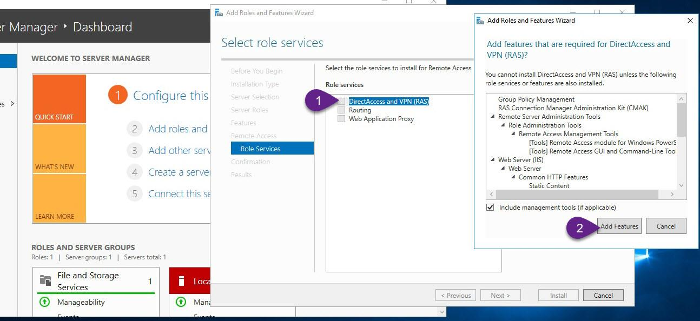
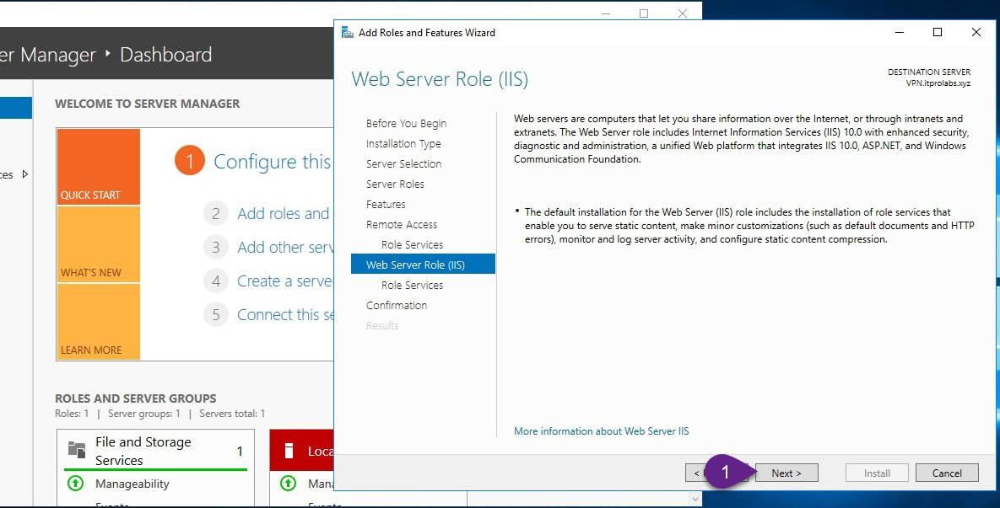
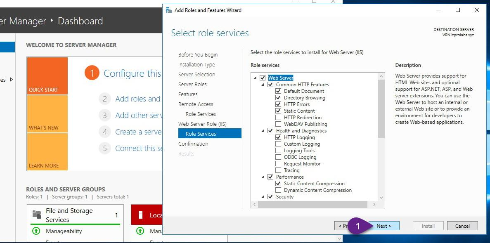
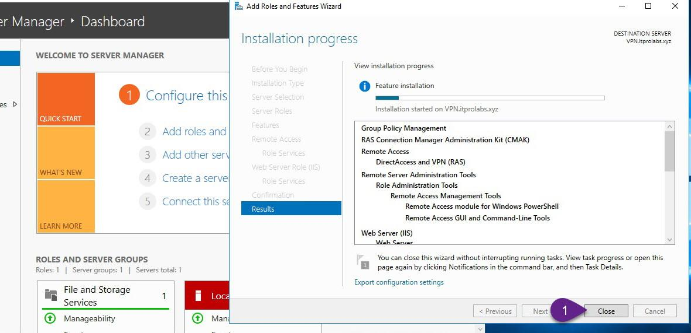
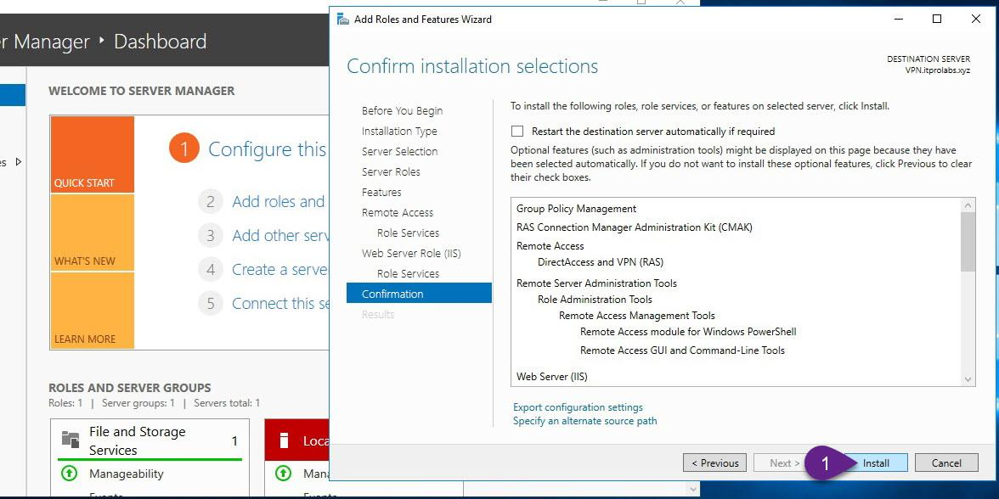

Step 3: Enable and configure routing and remote access (Enable VPN Service) 

1. On VPN, from Server Manager, open Routing and Remote Access. 
2. Right-click VPN (local), and then click Configure and Enable Routing and Remote Access 
and follow the instructions as explained in the figures below

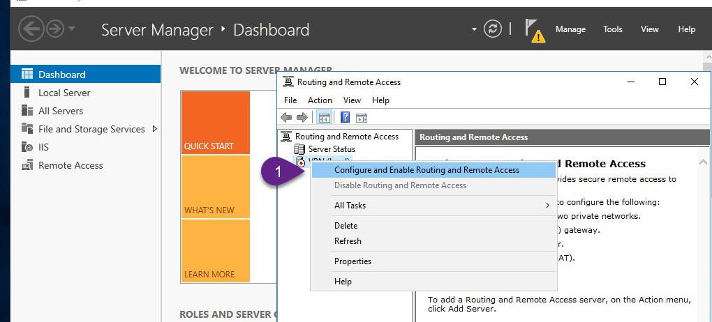

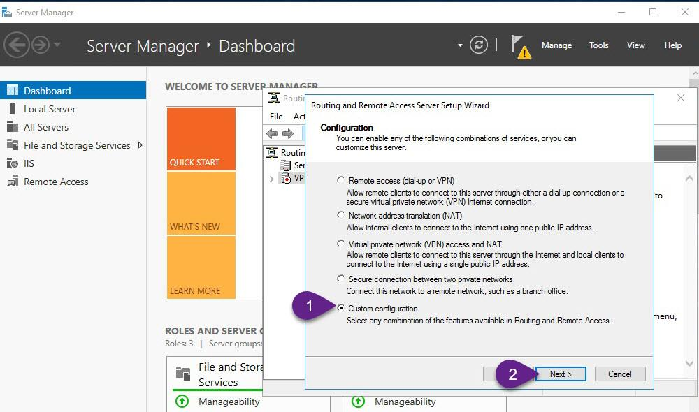
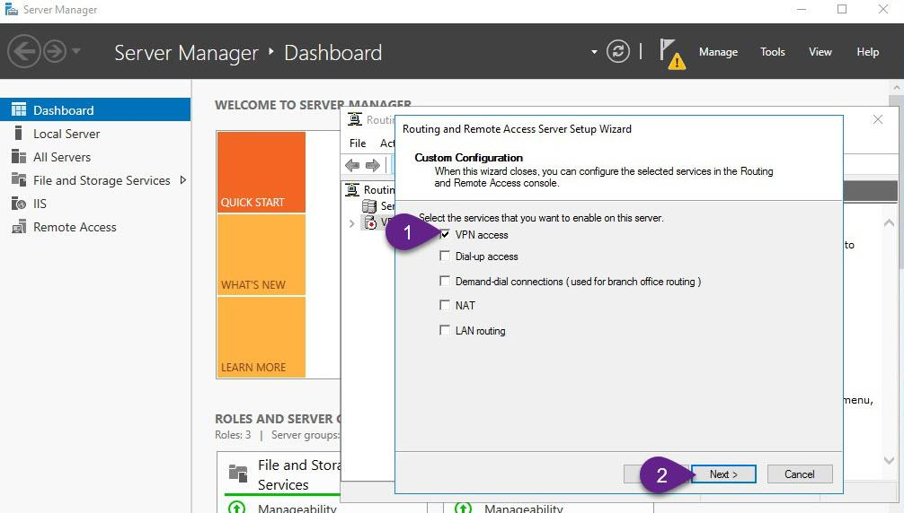
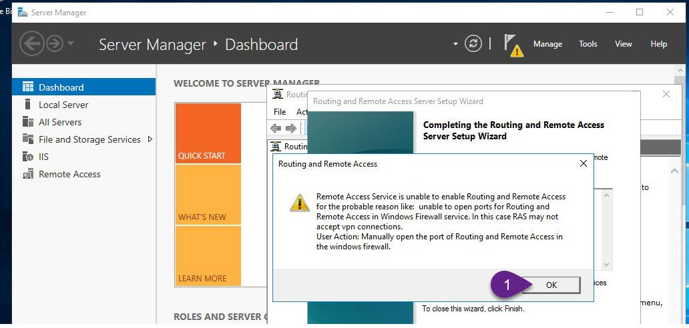
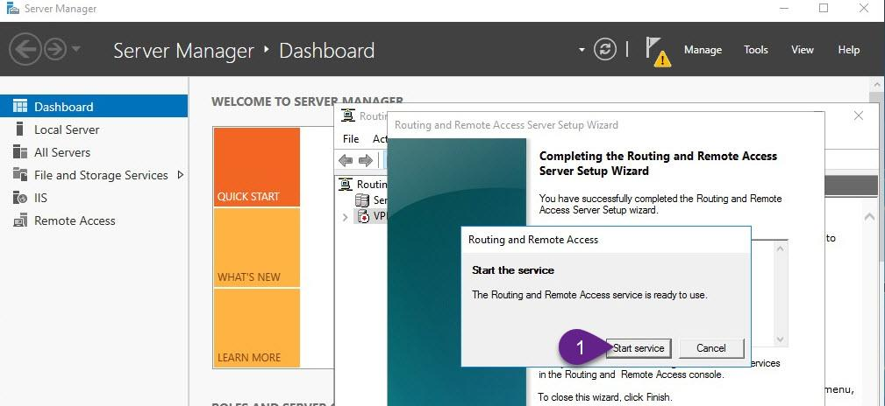

Step 4: Allow VPN clients to obtain TCP/IP configuration from DHCP and use internal DNS 

Here we will allow incoming VPN clients to obtain TCP/IP configuration from DHCP, also It’s better to allow VPN users to use the internal DNS server, so they can locate and access internal resources easily

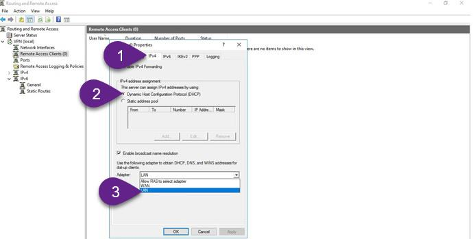

Step 5: Configure a preshared key for IPSec connection On VPN server configure preshared key that will be used in IPSec connections

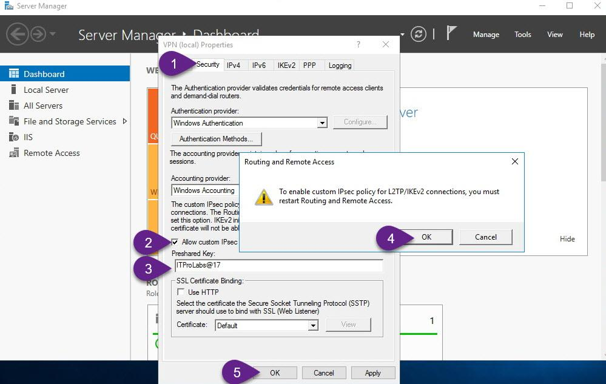

Disable PPTP connections 
By default, VPN Server can receive 128 concurrent PPTP, SSTP and L2TP connections, you can increase this number of concurrent connections or decrease it or disable it by decrease the mentioned number - 128 - to zero, as explained in the figures below

      
      
      
      
