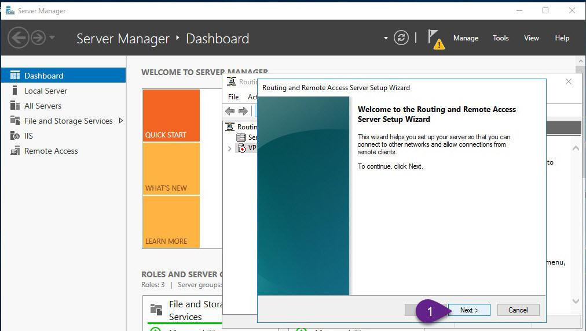
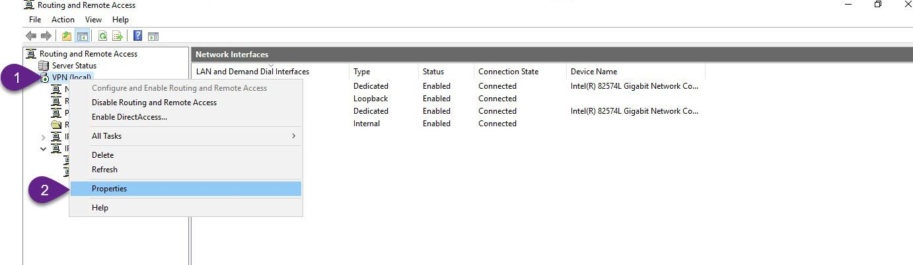
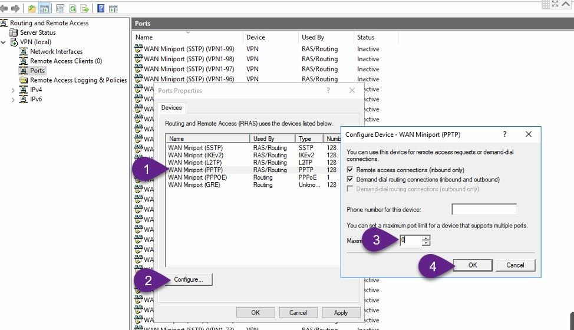

**[IPsecVPN](https://ghost0000heavy.github.io/IPsecVPN)**

* L2TP/IPsec VPN On Windows Server 2016

   **What is VPN?**
   
A Virtual Private Network (VPN) is a secure network tunnel that allows you to connect to your private network from internet locations. So, you can access and use your internal resources based on your permissions.

Existing Active directory environment 
1. OS: Windows server 2016 
2. Domain Name: ITPROLABS.XYZ 
3. Domain IP: 192.168.153.10/24 
4. IP Scheme: 192.168.153.0/24

 
 
**Existing DHCP Server Configuration: 

VPN clients will contact the DHCP server to obtain our internal TCP/IP configuration so they can access internal resources, the DHCP server configuration explained as below: 

1. Server IP: 192.168.153.10/24 
2. Scope range: 192.168.153.50 – 192.168.153.254 
3. DG: 192.168.153.2
4. DNS: 192.168.153.10

     

**VPN Server Setup and Configurations 

Server Name: VPN LAN 
IP: 192.168.153.11/24
WAN IP: public IP address 
**Network configuration: 
      We have 2 network interfaces one for LAN connectivity (in our domain scope) and another for WAN that will receive VPN client connection requests from internet.
      
 

**VPN Configuration Steps: 

Step 1: Join VPN Server to ITPROLABS.XYZ domain 

First, Join our VPN server to ITPROLABS.XYZ domain, so we can use active directory to authenticate the incoming VPN client connections.

Step 2: Add Remote Access role

On VPN server, from Server Manager add remote access role as explained in the figures below

Step 3: Enable and configure routing and remote access (Enable VPN Service) 

1. On VPN, from Server Manager, open Routing and Remote Access. 
2. Right-click VPN (local), and then click Configure and Enable Routing and Remote Access 
and follow the instructions as explained in the figures below

Step 4: Allow VPN clients to obtain TCP/IP configuration from DHCP and use internal DNS 

Here we will allow incoming VPN clients to obtain TCP/IP configuration from DHCP, also It’s better to allow VPN users to use the internal DNS server, so they can locate and access internal resources easily

Step 5: Configure a preshared key for IPSec connection On VPN server configure preshared key that will be used in IPSec connections

**Disable PPTP connections 

By default, VPN Server can receive 128 concurrent PPTP, SSTP and L2TP connections, you can increase this number of concurrent connections or decrease it or disable it by decrease the mentioned number - 128 - to zero, as explained in the figures below

**Allowing internet users to connect through VPN 

Step 1: Active Directory Configuration Create active directory group to only allow members of this group to connect through VPN, to do this from active directory users and computers we will create active directory group (VPN_Users) and add member user to it (aabdelwahed) so we can use him as user testing. The following instructions are configured on ITPROLABS.XYZ domain (DC01)

Now you can add members to this group that you want to allow them to connect through VPN

Step 2 : Configure the Remote Access policies (NPS)

Users you want to allow them to connect through VPN must have grant access permission from Network policy Server or give users dial in grant access (One by one) permission from active directory users and computers wizard, in our scenario we will configure this permission through Network Policy Server (NPS) to allow members of VPN_Users group (Bulk Users) that we just created in active directory to access the network through VPN. the following steps configured on VPN Server.
On VPN, from Server Manager, open the Network Policy Server console

add users and groups that you want to allow them to connect through VPN

from this wizard, we can apply some polices and restrictions on VPN clients like session time limit.

Configuration summary

Make sure that your created policy order is 1

**Testing

Create VPN connection from windows 10 Client .
First, create VPN connection to VPN Server public IP address (as explained in the figures below)

Now, configure our connection to use L2TP (as explained in the below figures)

**Allowinternet connectivity with VPN

By default, the connected to VPN clients can’t browse internet to solve this issues solved as explained in the figures below.

Connect to VPN Now you can use your VPN connection using aabdelwahed user who have grant access permission to connect through VPN according to his membership on VPN_Users group.

Now, run ipconfig /all to check your VPN connection configuration, so now you can access the network resources based on your permissions.

**Check connected VPN client Status 

Now back to VPN server to check status of connected users also you can force disconnect any connected users as explained in the figures below.

      
      
      
      
