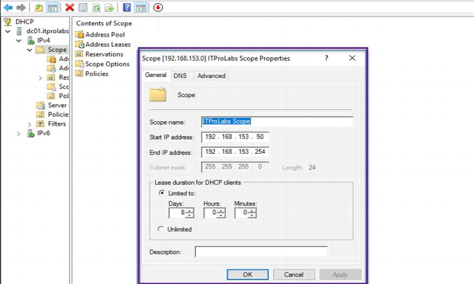

**[IPsecVPN](https://ghost0000heavy.github.io/IPsecVPN)**

* L2TP/IPsec VPN On Windows Server 2016

   What is VPN?
   
A Virtual Private Network (VPN) is a secure network tunnel that allows you to connect to your private network from internet locations. So, you can access and use your internal resources based on your permissions.

Existing Active directory environment 
1. OS: Windows server 2016 
2. Domain Name: ITPROLABS.XYZ 
3. Domain IP: 192.168.153.10/24 
4. IP Scheme: 192.168.153.0/24

 
 
Existing DHCP Server Configuration: 

VPN clients will contact the DHCP server to obtain our internal TCP/IP configuration so they can access internal resources, the DHCP server configuration explained as below: 

1. Server IP: 192.168.153.10/24 
2. Scope range: 192.168.153.50 – 192.168.153.254 
3. DG: 192.168.153.2
4. DNS: 192.168.153.10

 

VPN Server Setup and Configurations 

Server Name: VPN LAN 
IP: 192.168.153.11/24
WAN IP: public IP address 
**Network configuration: 
      We have 2 network interfaces one for LAN connectivity (in our domain scope) and another for WAN that will receive VPN client connection requests from internet.
      
      
      
      
